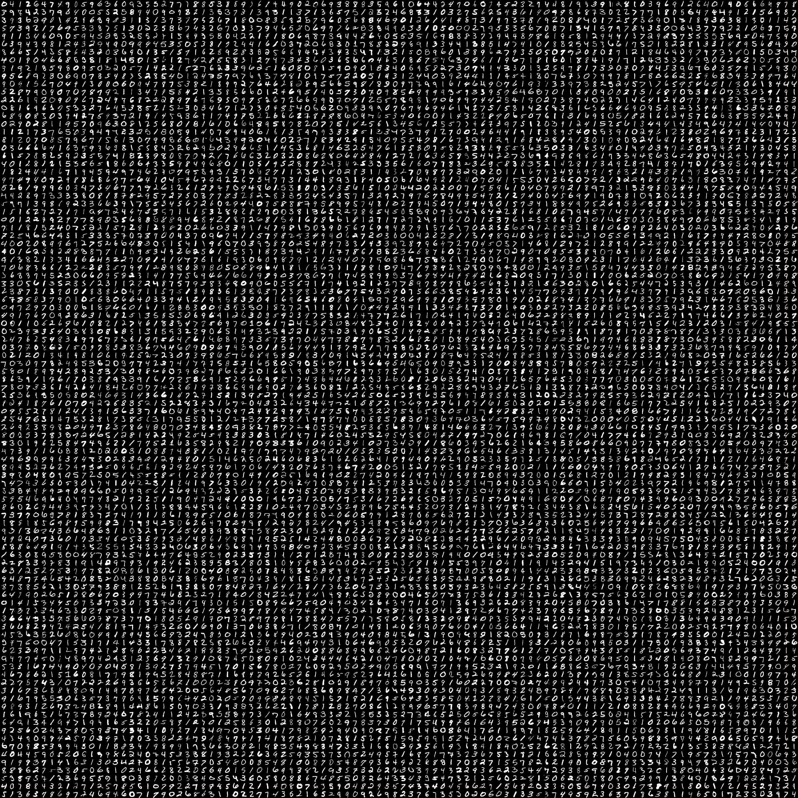

# Appendix

## Generate Facet Dive Static File

To use Facets Dive two things need to be prepare first.

* Json file

  This file should include prediction and label information, and data are placed in sequence order.

* Atlas Image

  Place all the image into Grid image.





```python
import tensorflow as tf

import numpy as np
import pandas as pd
from PIL import Image


###################################
# TensorFlow wizardry

## extra imports to set GPU options
import tensorflow as tf
from keras import backend as k
config = tf.ConfigProto()
 # Don't pre-allocate memory; allocate as-needed
config.gpu_options.allow_growth = True
 # Only allow a total of half the GPU memory to be allocated
config.gpu_options.per_process_gpu_memory_fraction = 0.3
 # Create a session with the above options specified.
k.tensorflow_backend.set_session(tf.Session(config=config))
###################################

#Load Dataset
datasets = tf.keras.datasets
model = tf.keras.models.load_model('modulize/models/cifar.h5')
(x_train, y_train), (x_test, y_test) = datasets.cifar10.load_data()


def array_to_sprite_atlas(image_array, num_sprites_x, num_sprites_y):
    "Takes an array of images of shape (num_images, img_width, img_height) and splices them together to form a big ass mosaic (sprite atlas)."
    # Mnist arrays are in 0-1 range, PIL needs 0-255
    image_array = image_array
    image_width, image_height = image_array.shape[1], image_array.shape[2]
    atlas_width  = num_sprites_x * image_width
    atlas_height = num_sprites_y * image_height
    # We paste the samples to get indices arranged in the following way:
    # | 0 | 1 | 2 | 3 |
    # | 4 | 5 | 6 | 7 |
    atlas  = Image.new("RGB", (atlas_width, atlas_height), (0, 0, 0))
    for i in range(num_sprites_y): 
        for j in range(num_sprites_x):
            sample = image_array[num_sprites_x * i + j, :, :]
            image = Image.fromarray(sample)
            atlas.paste(image, (j*image_width, i*image_height))
    return atlas
    
im = array_to_sprite_atlas(x_test,100,100)
im.save("./modulize/Facets/atlas_cifar10.jpg", "JPEG")
predictions = model.predict(x_test/255.0)
predictions = np.argmax(predictions, axis=1) # Reverse one hot
y_test_actual = y_test[:,0]


df = pd.DataFrame({"prediction": predictions, "actual": y_test_actual})
jsonstr = df.to_json(orient='records')

text_file = open("./modulize/Facets/jsonstr_cifar.txt", "w")
text_file.write(jsonstr)
text_file.close()
```




For Demo I use mnist and cifar10 datasets,all these images are square shape.  
When it comes to other shape image, you may need to reshape every image in the same size in order to generate grid image.



