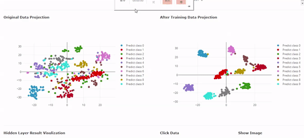
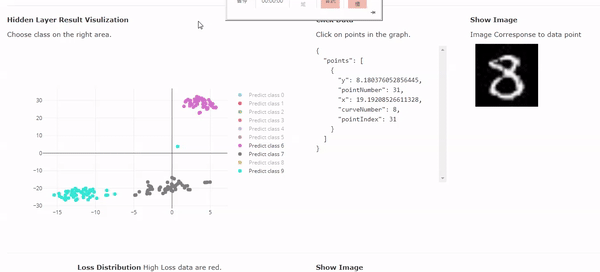
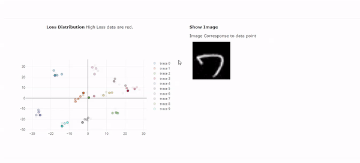
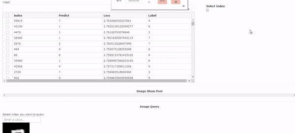
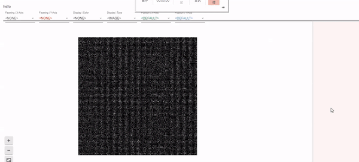
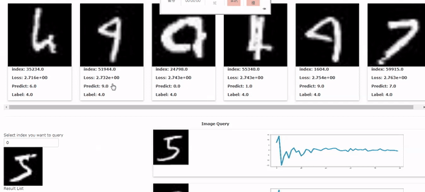

# Introduction

## Getting Start

### Install the library needed.

| Library | Link |
| :--- | :--- |
| Anaconda | [https://anaconda.org/](https://anaconda.org/) |
| plotly | pip install plotly [https://plot.ly/python/getting-started/](https://plot.ly/python/getting-started/) |
| Plotly dash | pip install dash==0.24.1 \# The core dash backend pip install dash-renderer==0.13.0 \# The dash front-end pip install dash-html-components==0.11.0 \# HTML components pip install dash-core-components==0.27.1 \# Supercharged components pip install plotly --upgrade \# Plotly graphing library used in examples [https://dash.plot.ly/installation](https://dash.plot.ly/installation) |
| Dash plugin | pip install dash-table-experiments[https://github.com/plotly/dash-table-experiments](https://github.com/plotly/dash-table-experiments) pip install dash-dangerously-set-inner-html [https://github.com/plotly/dash-dangerously-set-inner-html](https://github.com/plotly/dash-dangerously-set-inner-html) pip install grasia-dash-components [https://github.com/Grasia/grasia-dash-components](https://github.com/Grasia/grasia-dash-components) |
| Tensorflow | 1.9 version |

### Run Web Server

This is a web based application , type this command and see the result on browser.

```
$ cd project-dir
$ python3 index.py <./model/mnist.h5> <mnist>

open your browser on localhost:8050
```


It may take some time because of projection method and forward analysis.



If you load a very large model that is high GPU usage, remember to change GPU usage rate in util.py

`restrict_gpu_mem(`fraction=1`)`


## Overview

The tool provide a simple but overall visualization.You can see the strongly connection between data and the model.

### Model Preview

First, you can see the structure of the model and the dataset. 


### Data Projection View

We provide a comparison between data projection and hidden layer projection.  
Labels on the right is clickable , user can decide which class they care.  
Hover over the point will tell you basic info of the point.  
Zoom in also allowable , just focus on where you interest in!



### Data Interactive Panel

In this panel , click the scatter point ,and the image corresponded will show up on the right.  
User can look into the unusual point directly. Through the interactive process , we can get more understanding about the dataset. Even more ,sometimes we may find dirty data or bias problem early in training. 



### Hard Example Finding

Loss is important index for not only model perspective , it can be analyze on  data point.  
The deeper the color is ,the higher the loss is. Finding the hard example could be easily click on the deepest color point.



### Loss Dataframe

For those who are familiar with data analysis , loss dataframe is provided.  
Simple filter has been set up, query command can be type into the area,and result show up immediately.The image corresponded will be stack into image pool below.





For more type command used in loss dataframe , please check out [https://github.com/plotly/dash-table-experiments](https://github.com/plotly/dash-table-experiments)



Due to web deficiency issues, image pool will only show the latest 15 click point.


###  Google Facets Dive

Facets is a tool for  error analysis, and it provided a interactive interface with confusion matrix. User can not only get overview of the confusion matrix, but also zoom in to see what happen in each block.   





For more information about facet dive , you can check out their github  
[https://github.com/PAIR-code/facets](https://github.com/PAIR-code/facets) 


### Image Query

Check out the loss dataframe ,or image show pool , you can get the index of the hard example. Type the index into the input area,and query result will show up on the right.

Each image has it unique waveform,which is the hidden layer vector. If two image share similar waveform between each other, they are consider similar by the CNN model.  
  
Using this tool , user can find problems in their dataset. 




